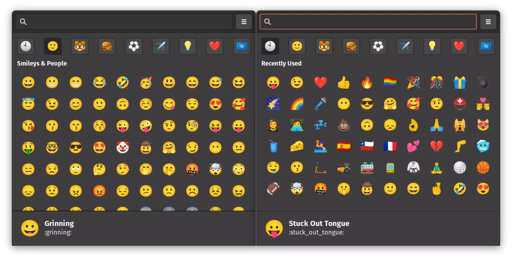
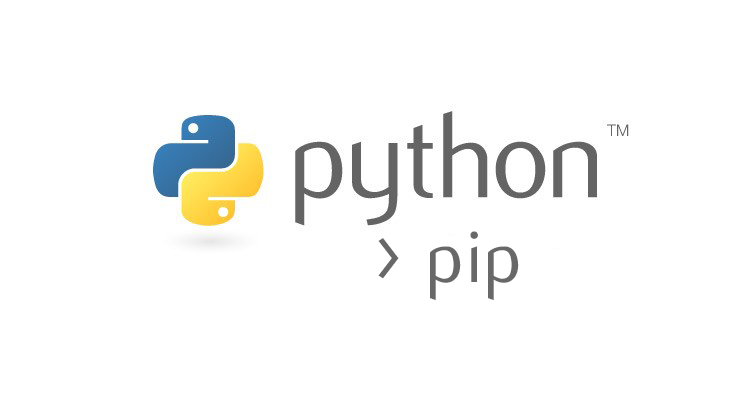

# Este documento mostra como configurar o ambiente de desenvolvimento no Linux no meu caso [Ubuntu](https://ubuntu.com/).
### Mudanças podem ocorrer como por exemplo autualizações das ferramentas, por isso deixei os comandos de intalação na versão lts, mesmo assim recomendo ver a documentação oficial ou sugerir um  pull request. E a medida do tempo colocarei mais coisas.

# Instalação do curl para fazer requisição http
```console
    sudo apt-get install curl
```

# NodeJS


### Adicionando o repositório lts do node

```console
    curl -fsSL https://deb.nodesource.com/setup_lts.x | sudo -E bash -
```
### atualizando o apt
```console
    sudo apt update
```

### instalando Nodejs

```console
    sudo apt-get install -y nodejs
```

### verificando se ele foi instalado com sucesso

```console
    node --version
```


# Yarn


### Adicionando a chave do yarn
```console
    curl -sS https://dl.yarnpkg.com/debian/pubkey.gpg | sudo apt-key add -
```
### Adicionando o yarn no pacote

```console
    echo "deb https://dl.yarnpkg.com/debian/ stable main" | sudo tee /etc/apt/sources.list.d/yarn.list
```
### atualizando o apt
```console
    sudo apt update
```

### E finalmente instalando o yarn
```console
    sudo apt install yarn
```
### Por último, para verificar se ele foi instalado corretamente.

```console
    yarn --version
```

# VSCode


### Instalando a versão classica

```console
    sudo snap install code --classic
```

# Git

### A instalação do git é bem fácil, mas caso queira consultar a doc. [documentação](https://git-scm.com/book/en/v2/Getting-Started-Installing-Git)

### atualizando o apt
```console
    sudo apt update
```
### Instalando o git
```console
    sudo apt install git-all
```

### configurando o usuário global obs. use aspas por volta do seu nome
```console
    git config --global user.name "seu-nome-do-git-hub"
```

### configurando o email global obs. não use aspas
```console
    git config --global user.email seu-email
```
### Quando você for fazer um commit para o github, ele vai pedir o nome do usuário, basta você colocar o user.name ou user.email dessa forma.

```console
    Username for 'https://github.com': user.name
```

### Agora para o token (senha entre aspas) você tem que colar o que foi gerado na sua conta 
### podendo acessar com [Persolnal access tokens](https://github.com/settings/tokens)

# Emote

### essa ferramenta permite adicionar emotes nos campos de texo e é muito últil no desenvolvimento principalmente no mobile.

```console
    sudo snap install emote
```


# Expo

### Instalação do expo esta bem detalhada na documentação, mas decidi colocar mesmo assim para servir de roteiro

```console
    sudo npm install --global expo-cli
```

# Docker

### O docker também tem uma [documentação](https://docs.docker.com/engine/install/ubuntu/) bem detalhada de como installar, porém vou resumila.

### Atualizando o apt
```console
    sudo apt-get update
```

```console
    sudo apt-get install ca-certificates curl gnupg lsb-release
```

```console
    -fsSL https://download.docker.com/linux/ubuntu/gpg | sudo gpg --dearmor -o /usr/share/keyrings/docker-archive-keyring.gpg
```

```console
    echo \
  "deb [arch=$(dpkg --print-architecture) signed-by=/usr/share/keyrings/docker-archive-keyring.gpg] https://download.docker.com/linux/ubuntu \
  $(lsb_release -cs) stable" | sudo tee /etc/apt/sources.list.d/docker.list > /dev/null
```

```console
    sudo apt-get update
```
```console
    sudo apt-get install docker-ce docker-ce-cli containerd.io
```

### Para testar se foi instalado com sucesso reode esse comando

```console
    sudo docker run hello-world
```
# 
## tem que aparecer uma mensagem como essa:

###    Hello from Docker!
###  This message shows that your installation appears to be working correctly.


## Se você quer começar a usar o docker com postgres eu recomendo muito o [post](https://baraus.dev/articles/postgresql-+-docker/) do Bruno de Araujo. Estou compartilhando porque ele me ajudou dms com uma doc bem detalhada e fácil de entender.

# Pip3

### As vezes eu gosto de brincar com python, no linux, a terceira versão já vem instalado porém seu gerenciador de pacote não.

### Atualizando o apt
```console
    sudo apt-get update
```

### Instalando o pip3
```console
    sudo apt install python3-pip
```


